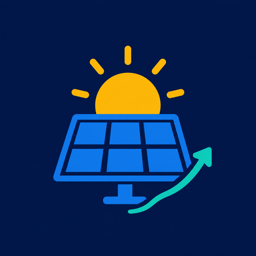

<p align="center">
  
</p>

# PV-Ertragsprognose für Home Assistant

`pv_forecast` ist eine Custom Integration für Home Assistant. Sie berechnet den
erwarteten Energieertrag einer PV-Anlage für den lokalen heutigen und morgigen
Tag. Als Wetter- und Strahlungsdatenquelle dient
[Open-Meteo](https://open-meteo.com/).

Die Einrichtung und spätere Konfiguration erfolgen vollständig über die
Home-Assistant-Oberfläche. YAML wird nicht unterstützt.

## Funktionen

- Prognose für heute und morgen in kWh
- Gesamtwerte für die Anlage und Einzelwerte je Dachfläche
- mehrere Dachflächen mit eigener Leistung, Ausrichtung, Neigung und eigenem
  Systemwirkungsgrad
- Übernahme des in Home Assistant hinterlegten Standorts oder einmalige
  Adressauflösung über Nominatim
- optionales AC-Leistungslimit für einen gemeinsam genutzten Wechselrichter
- stabile Sensor-IDs, auch wenn eine Dachfläche umbenannt wird
- automatische Aktualisierung alle 30 Minuten

Die Integration legt ausschließlich Prognosesensoren an. Wetter-,
Einstrahlungs-, Temperatur-, Status- und Debug-Sensoren gehören nicht zum
Funktionsumfang.

## Installation

### HACS

1. Öffne in HACS die benutzerdefinierten Repositorys.
2. Füge `https://github.com/dr-dimitri/pv-forecast-ha` als Repository der
   Kategorie **Integration** hinzu.
3. Lade **PV-Ertragsprognose** herunter.
4. Starte Home Assistant neu.
5. Öffne **Einstellungen → Geräte & Dienste → Integration hinzufügen** und
   suche nach **PV-Ertragsprognose**.

Nach einem Update kann ein vollständiges Neuladen der Home-Assistant-Seite
erforderlich sein (`Strg`/`Cmd` + `Umschalt` + `R`), damit der Browser keine
älteren Formulartexte aus dem Cache verwendet.

### Manuelle Installation

Kopiere den Ordner `custom_components/pv_forecast` in das Verzeichnis
`custom_components` deiner Home-Assistant-Konfiguration. Starte Home Assistant
anschließend neu und füge die Integration über **Einstellungen → Geräte &
Dienste** hinzu.

## Einrichtung

### 1. Standort wählen

Die Integration bietet zwei Standortquellen:

- **Home-Assistant-Standort:** Verwendet Standortname, Koordinaten, Land und
  Zeitzone aus den allgemeinen Einstellungen von Home Assistant.
- **Andere Anschrift:** Wandelt Postleitzahl, Straße mit Hausnummer und Land
  einmalig über Nominatim in Koordinaten um.

Für spätere Prognosen werden ausschließlich die gespeicherten Koordinaten
verwendet. Es findet keine regelmäßige Adressauflösung statt.

### 2. Dachflächen konfigurieren

Mindestens eine Dachfläche ist erforderlich.

| Einstellung | Beschreibung |
| --- | --- |
| Name | Eindeutige Bezeichnung, beispielsweise „Süddach“ |
| Installierte Leistung | Nennleistung der Module in kWp, größer als 0 |
| Ausrichtung | Himmelsrichtung der Dachfläche |
| Neigung | Dachneigung von 0° bis 90° |
| Systemwirkungsgrad | Verbleibender Anteil nach pauschalen Verlusten, standardmäßig 90 % |

Ein Systemwirkungsgrad von 90 % entspricht einem pauschalen Gesamtverlust von
10 %. Darin können beispielsweise Wechselrichter-, Leitungs- und
Verschmutzungsverluste zusammengefasst werden. Der Wert ersetzt keine
detaillierte elektrische Simulation.

### 3. Wechselrichterlimit festlegen

Optional kann die maximale AC-Leistung des gemeinsamen Wechselrichters in kW
angegeben werden. Überschreitet die berechnete Gesamtleistung dieses Limit,
werden die Beiträge der Dachflächen proportional reduziert.

Vor dem Speichern prüft die Integration den Zugriff auf Open-Meteo und zeigt
eine Zusammenfassung der Konfiguration. Standort, Dachflächen und
Wechselrichterlimit lassen sich von dort gezielt korrigieren.

Die Konfiguration kann später unter **Einstellungen → Geräte & Dienste →
PV-Ertragsprognose → Konfigurieren** geändert werden. Ein Menü bietet dort
gezielt einzelne Aktionen an: eine Dachfläche hinzufügen, eine bestehende
bearbeiten (ihre technische ID bleibt dabei erhalten), eine Dachfläche nach
ausdrücklicher Bestätigung entfernen oder das Wechselrichterlimit ändern.
Jede Aktion wirkt für sich allein, ohne die übrigen Dachflächen anzufassen.

## Sensoren

Die Integration erstellt folgende Sensoren:

- `Prognose heute` und `Prognose morgen` für die Gesamtanlage
- `<Dachfläche> Prognose heute` und `<Dachfläche> Prognose morgen` für jede
  konfigurierte Dachfläche

Alle Sensorwerte werden in kWh ausgegeben.

## Berechnungsmodell

Die Energie wird für jedes Wetterintervall nach folgendem Modell berechnet:

```text
Rohleistung [kW] = installierte Leistung [kWp] × GTI [W/m²] / 1000
Temperaturfaktor = 1 + (-0,0035 × (Außentemperatur [°C] - 25 °C))
Leistung [kW] = Rohleistung × Temperaturfaktor × Systemwirkungsgrad
Energie [kWh] = Leistung × tatsächliche Intervalldauer [h]
```

Die Außentemperatur dient dabei nur als Näherung für die Zelltemperatur. Die
Berechnung berücksichtigt lokale Tagesgrenzen, Zeitumstellungen und die
Open-Meteo-Semantik, nach der ein GTI-Zeitstempel den Mittelwert der
vorhergehenden Stunde bezeichnet.

## Grenzen

Die Prognose ist ein vereinfachtes Modell und keine vollständige
Anlagensimulation. Nicht berücksichtigt werden insbesondere:

- Verschattung und detaillierte Modul- oder Stringeigenschaften
- automatische Kalibrierung anhand realer Erträge
- Batteriespeicher, Eigenverbrauch, Wallboxen und Ladeplanung
- Prognosetage nach morgen
- weitere Wetteranbieter

## Datenschutz und Datenquellen

- Wetter- und Strahlungsdaten stammen von
  [Open-Meteo](https://open-meteo.com/) und werden unter
  [CC BY 4.0](https://creativecommons.org/licenses/by/4.0/) bereitgestellt.
- Bei manueller Adresseingabe wird einmalig eine strukturierte Suchanfrage an
  [Nominatim](https://nominatim.org/) gesendet. Die zugrunde liegenden
  Kartendaten sind © [OpenStreetMap-Mitwirkende](https://www.openstreetmap.org/copyright)
  und stehen unter ODbL.
- Bei Übernahme des Home-Assistant-Standorts wird keine Anschrift an Nominatim
  übertragen.

## Entwicklung

```bash
python3 -m venv .venv
.venv/bin/pip install --requirement requirements_test.txt
.venv/bin/ruff check custom_components tests
.venv/bin/black --check custom_components tests
.venv/bin/pytest -v
```

Beim Mergen eines Pull Requests erstellt die Release-Automation standardmäßig
ein Patch-Release. Mit genau einem der Labels `release:major`, `release:minor`
oder `release:patch` wird der gewünschte Teil der Versionsnummer erhöht.
