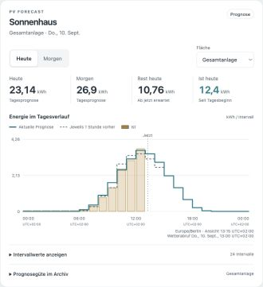
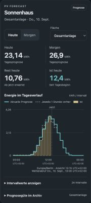

# PV-Forecast-Karte

Die freiwillige Karte zeigt die PV-Erzeugung in deinem bestehenden
Home-Assistant-Dashboard. Sie benötigt keine weiteren Karten, Templates oder
zusätzlichen Wetterzugänge. Das Backend funktioniert weiterhin ohne Karte.

## Installation ohne YAML

1. Die Integration über HACS als benutzerdefiniertes Repository
   `dr-dimitri/pv-forecast-ha` vom Typ **Integration** installieren beziehungsweise
   aktualisieren und Home Assistant neu starten. Das Kartenmodul gehört zum
   Integrationspaket; es ist kein separates HACS-Frontend-Repository.
2. Im Benutzerprofil gegebenenfalls den erweiterten Modus aktivieren. Unter
   **Einstellungen → Dashboards → Drei-Punkte-Menü → Ressourcen** eine Ressource
   hinzufügen: URL `/pv_forecast/pv-forecast-card.js?v=1`, Typ **JavaScript-Modul**.
   Vorhandene Ressourcen nicht löschen. Bei einer späteren Modulversion die
   Versionskennung gemäß den Versionshinweisen ändern und den Browser neu laden.
3. Das gewünschte Dashboard bearbeiten, **Karte hinzufügen → PV Forecast** wählen
   und im visuellen Editor die Anlage auswählen. Titel und Standardtag sind
   optional. Speichern; Tages- und Dachauswahl stehen anschließend in der Karte.

Diese Ressourcenverwaltung ist der
[offizielle HA-Installationsweg für Custom Cards](https://developers.home-assistant.io/docs/frontend/custom-ui/registering-resources/).
Das Paket unterstützt dieselbe Mindestversion wie die Integration (HA 2025.12).
Die Karte prüft `schema_version=1` und `view_version=1`. Wenn die
Darstellungsdaten noch fehlen, zeigt sie einen verständlichen Updatehinweis.
Dashboard-Ressourcen werden nicht automatisch in andere Konfigurationen
hineingeschrieben. Nach Entfernen der Integration kann ihre Kartenressource in
diesem Dialog ebenfalls entfernt werden.

## Werte und Kurven verstehen

Die vier Kennzahlen beziehen sich auf die ausgewählte Gesamtanlage oder
Dachfläche: Prognose heute, heute bereits erfasst, verbleibende Prognose heute
und Prognose morgen. „Heute erwartet“ umfasst den gesamten heutigen Tag; es
ist keine Addition aus Messung und Restprognose. Datum und Uhrzeit beziehen
sich auf die gespeicherte Anlagenzeitzone, auch wenn dein Browser woanders ist.

- **Aktuelle Prognose:** die gemeinsame berechnete Energie in kWh je angezeigtem
  UTC-Intervall. Die Linie ist durchgezogen.
- **Jeweils 1 Stunde vorher:** rechtzeitig archivierte Prognosen mit festem
  Vorlauf. Die gestrichelte Linie hat pro Intervall einen eigenen Stichtag;
  sie ist keine gemeinsam am Vortag ausgegebene Tageskurve. Ohne rechtzeitige
  Archivierung bleiben die betreffenden Stücke leer.
- **Gemessen:** genau belegte Energiemengen aus bestätigten, disjunkten
  AC-PV-Messquellen. Unvollständige Stunden werden nicht interpoliert. Ein
  erfasster Tagesanteil wird ausdrücklich als unvollständig bezeichnet.

Dachmesswerte und Dacharchive sind bislang nicht zugeordnet. In der Dachansicht
werden deshalb ausschließlich ihre tatsächlich berechneten Prognosen gezeigt;
Gesamtmessungen werden nicht nach Dachgröße verteilt. Ohne Messquelle bleibt
die Karte als reine Prognoseansicht nutzbar. Ohne Archiv fehlen die historische
Linie und belastbare Fehlerkennzahlen. Eine gültig gemessene Null ist etwas
anderes als eine Datenlücke.

Die erste Kartenfassung verwendet ausschließlich eine Energieachse in kWh je
Intervall. Sie mischt keine momentane Leistung in kW hinein. Bei Zeitumstellungen
hat die Tagesachse 23 oder 25 Stunden; wiederholte Ortsstunden werden mit ihrem
UTC-Offset unterschieden. Teilstunden an lokalen Tagesgrenzen behalten ihre
wirkliche Breite und Energiemenge. Die bekannte Einschränkung der nativen
Energy-Grafik aus #53 gilt nicht als Zeitmodell für diese eigene Darstellung.

Die vertiefende 7-/30-Tage-Ansicht verwendet die eingefrorene Archivstichprobe
mit MAE und Bias in kWh, Paaranzahl und Abdeckung. Das ist keine Prozentangabe
zur vermeintlichen Genauigkeit. Details und Formeln stehen im
[Prognosearchivvertrag](prognosearchiv.md). Kalibrierung und Unsicherheitsband
werden erst mit den jeweiligen Folgefunktionen eingeführt.

## Datenzugriff und Fehlerzustände

Die Karte liest vorhandene Daten über `get_forecast`, `get_measurements` und
`get_history`. Die zusätzlichen Darstellungsfelder sind versioniert; das
Backend berechnet Tageswerte, Dachbeiträge und exakt belegte Messintervalle.
Der Browser positioniert und formatiert diese Werte. Er fragt weder Open-Meteo
noch den Recorder ab und berechnet kein zweites PV-Modell.

Gleiche Kartenanfragen werden pro HA-Verbindung gemeinsam genutzt und im
lokalen Minutentakt nachgeführt. Wenn keine sichtbare Karte die Daten nutzt
oder das Browserdokument ausgeblendet ist, endet der Abrufrhythmus. Beim erneuten
Einblenden nimmt die Karte ihre Leseaufrufe wieder auf. Die üblichen
30-Minuten-Wetterabrufe des Coordinators ändern sich nicht. Ein Leseaufruf
speichert keine Historie und verändert keine Prognose.

Die Anlage und alle beteiligten aktuellen beziehungsweise historischen
Quellidentitäten bleiben berechtigungsgeprüft. Fehlende Rechte auf Mess- oder
Archivquellen verdecken die weiterhin erlaubte reine Prognose nicht. Ein
Forecast-Fehler beziehungsweise ein über 60 Minuten alter Abruf wird sichtbar
als veraltet ausgewiesen. Fehlt der aktuelle lokale Tag im alten Snapshot,
erscheint keine alte Tageszahl unter dem Namen „heute“.

Leere Historie, noch nicht zugeordnete Messung, Ladezustand und Ausfall erhalten
jeweils eigene Hinweise. Bei eingeschränkten Leserechten hilft die
Administratorin oder der Administrator mit der gezielten Quellenfreigabe;
die Karte umgeht diese Rechte nicht.

## Prüfung und ausstehende Nutzererprobung

Die Offline-Fixtures prüfen Sommer-/Winterzeit, Teilstunden und einen Browser
mit anderer Zeitzone sowie fehlende, nullwertige und veraltete Daten. Desktop
und 360-px-Ansicht werden in Hell und Dunkel visuell geprüft. Beschriftete
Bedienelemente, Tastaturzugriff und eine aufklappbare Wertetabelle ergänzen die
Grafik.

Die Kartenlogik wird ohne zusätzliche Node-Pakete mit
`node --test tests/frontend/*.test.mjs` geprüft (CI: Node.js 24). Die
Browser-Demo liegt unter `tests/frontend/demo.html` und simuliert ausschließlich
die drei vorhandenen Leseaktionen. Ihr Aufrufzähler macht gemeinsame Abrufe
und das Pausieren beim Ausblenden überprüfbar.

Die folgenden Browseraufnahmen stammen aus der deterministischen Offline-Demo
mit synthetischen Prognosen und Messwerten; sie zeigen keine reale Anlage.

| Desktop, hell | Desktop, dunkel |
| --- | --- |
|  |  |

| Mobil, hell (360 px) | Mobil, dunkel (360 px) |
| --- | --- |
|  |  |

Die moderierten Tests mit fünf realen PV-Anwendern aus #28 sind weiterhin
geplant. Automatisierte Prüfungen und Screenshots ersetzen weder diese Tests
noch einen gemessenen Qualitätsvorsprung der Prognose.
