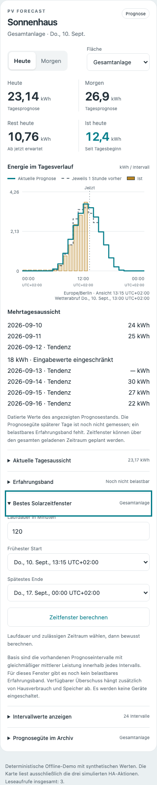
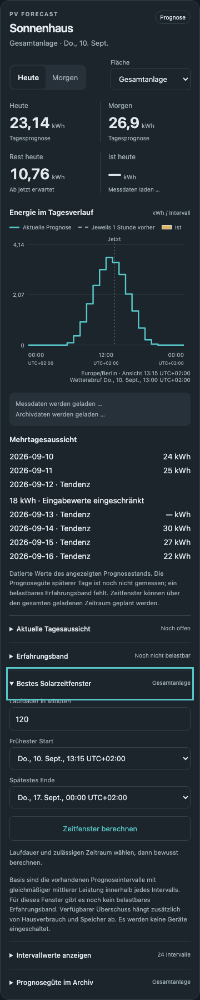

# Optionaler Mehrtageshorizont

**Konfigurieren → Prognosehorizont** erlaubt zwei bis sieben lokale Tage.
Bestehende Anlagen verwenden weiterhin zwei. Die Karte zeigt datierte kWh-Werte
für die gewählte Gesamtanlage oder Dachfläche. Ab dem dritten Tag steht
„Tendenz“. Ein fehlender Wert ist ein Gedankenstrich; Eingabefallbacks bleiben
sichtbar. Der Wetterabruf und der Fehlerstatus gelten für den gesamten Stand.

`pv_forecast.get_forecast` behält Schema 1 und ergänzt `forecast_days`.
`intervals` enthält den gesamten gewählten Horizont, einschließlich tatsächlicher
UTC-Grenzen. `view.daily_forecasts` ergänzt Datum, kWh oder null, Tendenz und
Eingabequalität. `measured_quality.status` ist mangels passender historischer
Vorläufe `unavailable`. Bestehende Tages-/Stundenbänder werden nicht auf spätere
Tage übertragen. Gleiche UTC-Zeitreihe und AC-Grenzen gelten für alle Tage.

Die Solarzeitfensterplanung erlaubt frühesten Start und spätestes Ende innerhalb
dieses Horizonts. Laufdauer bleibt 1–2880 Minuten. Ein Zeitraum mit späteren
Tagen wird in der Antwort durch `includes_tendency` gekennzeichnet. Der
Offline-Nutzungstest stellt an den ersten Tagen 1 kW und am vierten Tag von
12 bis 14 Uhr 2 kW bereit. Für einen zweistündigen Verbraucher wählt der Server
das spätere Fenster mit 4 statt 2 kWh. Das ist ein überprüfter Planungspfad,
kein Nachweis tatsächlicher Einsparung oder verbesserter Wetterprognose.

Energy liefert weiterhin ausschließlich heute und morgen. Beide aktuellen
lokalen Tage müssen vollständig abgedeckt sein; ein noch frischer Stand vom
Vortag bleibt dadurch nach Mitternacht nutzbar. Zusätzlich muss der letzte
Wetterabruf erfolgreich gewesen sein und sein Abrufzeitpunkt zwischen jetzt und
einschließlich 60 Minuten zurückliegen. Fehlende oder zukünftige Abrufzeitpunkte
und ältere Stände ergeben keine Energy-Prognose, auch wenn bei ausgeschaltetem
Polling noch mehrere Tage abgedeckt wären. Der native Vertrag kann Alter und
Fehler nicht anzeigen. Diese Prüfung liest nur vorhandene Daten und löst keine
Aktualisierung aus.

Sensorzahl und Unique-IDs bleiben unverändert. Archiv, Lernen und Erfahrungsbänder
behalten ihre bestehenden Stichtage und Aufbewahrungsgrenzen. Auch ein Wechsel von
sieben zurück zu zwei Tagen verändert keine historische Anlagenidentität.

## Datenumfang und Kontingent

Die [Open-Meteo-Dokumentation](https://open-meteo.com/en/docs) unterstützt
explizite Start-/Endstunden; die Strahlung bezieht sich auf die vorhergehende
Stunde. Geladen werden genau die UTC-Stunden, welche die gewählten lokalen
Tage überdecken. DST und Teilstundenoffsete benötigen entsprechend andere
Intervallzahlen, keine zusätzlichen Geometrie-Requests.

Ein UTC-Fenster benötigt bei konstantem Stundenraster 48 statt 168 Intervalle
für zwei beziehungsweise sieben Tage, jeweils zwei Wettervariablen.
`test_forecast_horizon.py` misst die Zahl der HTTP-Aufrufe und die serialisierte
Antwortgröße separat: gleiche Geometrie bedeutet weiterhin einen Request,
die Siebentagesantwort ist größer. Das ist eine Offline-Messung synthetischer
Antworten; Kompression und reale Zahlenlängen sind darin nicht abgebildet.

Nach den am 09.09.2026 geprüften [Kontingentregeln des Anbieters](https://open-meteo.com/en/pricing)
entspricht ein Request mit zwei Variablen und höchstens sieben Tagen üblicherweise
einem gezählten API-Call. Diese Anbieterzählung ist kein lokal gemessener
Abrechnungswert und bleibt von HTTP-Aufrufen und Antwortbytes getrennt.
Es werden keine zusätzlichen Requests zur Kontingentmessung gesendet.

## Prüfung

Offline-Tests prüfen 2/7 Tage, 23-/25-Stunden-Tage und Kathmandu, letzte GTI-Stunde,
Clipping und Kalibrierung, Optionsgrenzen und unveränderte Entity-Zahl.
Die mobile Karte wurde bei 360 px in Hell/Dunkel, mit einer Datenlücke und
Tastaturbedienung geprüft. Die Darstellungen enthalten ausschließlich Testdaten.

