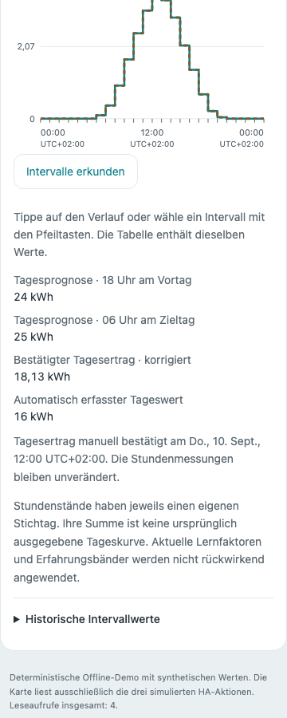
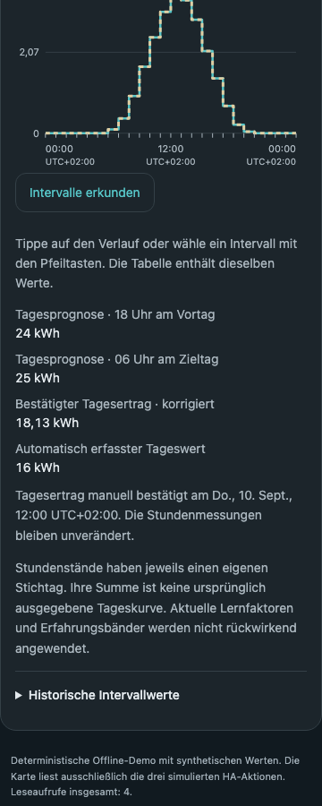

# Tagesertrag nachträglich korrigieren

Wenn der endgültige PV-Tagesertrag deines SmartMeters von der automatisch
erfassten Tagesmenge abweicht, kannst du ihn als maßgeblichen Wert bestätigen.
Die Integration bewahrt den ursprünglichen Messbeleg zusätzlich. Das hilft bei
der Fehlersuche und erlaubt, eine Eingabe wieder zurückzunehmen.

## Eingabe

1. Öffne **Einstellungen → Geräte & Dienste → PV-Ertragsprognose → Konfigurieren →
   Tagesertrag korrigieren** bei der betreffenden Anlage.
2. Wähle das Datum eines abgeschlossenen Tages. Das Datum gehört zur damals
   gespeicherten Anlagenzeitzone. Bei mehreren Anlagen- oder Quellenständen
   für dieses Datum wählst du zusätzlich die passende Messgrenze.
3. Prüfe Datum, Messgrenze, automatisch erfassten Wert und eine vorhandene
   Korrektur. Trage den endgültigen **Tagesgesamtertrag in kWh** ein. Trage
   weder die Differenz noch den fortlaufenden Gesamtzählerstand ein. Null ist
   ein gültiger Tagesertrag.
4. Bestätige, dass der Wert für den gesamten Tag und die gesamte angegebene
   AC-PV-Messgrenze gilt. Speichere mit dem Abschluss des Formulars.

Der Zählerwert muss die PV-Erzeugung belegen. Netzexport, Haushaltsverbrauch
und Batterieentladung gehören nicht hinein. Eine höhere oder niedrigere Zahl
ist allein kein Ausschlussgrund.

Du kannst denselben Tag erneut öffnen und den Wert ändern. Mit **Korrektur
zurücknehmen** und der Bestätigung gilt wieder die erhaltene automatische
Bewertung. War diese unvollständig oder fehlte sie, wird der Tag dadurch wieder
unvollständig. Schließen vor der Bestätigung speichert nichts. Nach angezeigtem
Speicherfehler bestätigst du erneut; bis zum erfolgreichen Schreiben kann die
Änderung nur vorübergehend angewendet sein. Ein inzwischen geänderter Tagesstand
oder Anlagenentwurf muss neu geöffnet werden.

## Wirkung

Der korrigierte Tageswert ersetzt den automatisch erfassten Wert bei den
Tagesbewertungen beider passenden Prognosestichtage. Soll-Ist-Berichte,
Tagesvergleiche, Selbstkalibrierung, Tages-Erfahrungsbänder und experimentelle
Minderertragshinweise lesen dieselbe maßgebliche Bewertung. Ihre sonstigen
Zulassungs- und Qualitätsregeln bleiben bestehen. Eine Korrektur garantiert
deshalb keine sofortige Kalibrierung oder bessere Prognose. Betroffene
Lernfreigaben und Beobachtungsnachweise werden erneut geprüft.

Die Korrektur erhält ihren tatsächlichen Bestätigungszeitpunkt. Frühere
Trainings-/Prüfentscheidungen dürfen sie nicht als damals schon bekannt
verwenden. Bis zu drei frühere Bewertungsrevisionen bleiben vorhanden;
der ursprüngliche automatische Messbeleg bleibt während der aktiven Korrektur
unabhängig von dieser Revisionsgrenze erhalten.

In **Analyse → Archivtag erkunden** heißt der Tageswert „Bestätigter Tagesertrag ·
korrigiert“. Der automatisch erfasste Tageswert steht daneben. Eine bereits
geöffnete Ansicht liest ihn nach **Aktualisieren** neu. Die Kartenansicht bietet
die letzten 90 Tage; ältere Tageskorrekturen bleiben im Optionsdialog erreichbar.
`get_history` und der JSON-/CSV-Export liefern die aktuelle Bewertung mit
`manual: true`, den Bestätigungszeitpunkt und den erhaltenen automatischen
Messbeleg unter `measured_assessment` bei den Datensätzen.

Ein Tagesgesamtwert belegt keine bestimmte Stundenverteilung. Deshalb bleiben
Stundenmessungen, gleitende Fenster und die laufende Tagesaussicht unabhängig
von der Tageskorrektur. Die Integration schreibt weder Rohzähler noch fremde
Sensoren oder Energy-Dashboard-Messwerte um. Es gibt keine zusätzlichen
Wetter- oder Geräteabrufe und keinen Reload für eine Tageskorrektur.

## Verfügbarkeit und Speicherung

Das Prognosearchiv muss vorher aktiviert worden sein. Korrigierbar sind
vorhandene Tagesstände der letzten **365 abgeschlossenen lokalen Tage** mit
zugeordneten PV-Energiequellen; auch ein inzwischen pausiertes Archiv ist
bearbeitbar. Fehlende automatische Tagesmessung kann durch die bewusste
Bestätigung ergänzt werden. Ohne gespeicherte Tagesprognose wird keine
historische Prognose erfunden. Laufende und zukünftige Tage sind nicht endgültig
und werden hier nicht angeboten. Alte Standort- und Quellenkontexte bleiben
getrennt; eine Korrektur wird nicht auf eine andere Messgrenze übertragen.

Die Daten liegen im bestehenden lokalen Archiv-Store Version 7. Vorversionen
1–6 werden verlustfrei übernommen, ohne alte Korrekturen zu erfinden. Es gibt
keinen zusätzlichen Store; Config Entries bleiben bei Version 1.1. Die
bisherigen Grenzen von 6.000 Archivzielen und 32 MiB gelten weiter.
Quellenlöschung entfernt auch deren Korrekturen, Originalbelege und Revisionen.
Archivlöschung und Entfernen der Integration löschen sie ebenfalls. Die Eingabe
nutzt den administrativen Options Flow; Leseaktionen behalten ihre bisherigen
Quellenrechte.

## Technische Prüfung

Die automatisierten Tests prüfen Bestätigung, Änderung, Rücknahme, Nullwerte,
fehlende Messung, Speichern/Neustart, Quellenlöschung, veraltete Dialoge,
Schreibfehler, Zeitumstellungen und den Übergang in Tagesberichte und Lernen.
Die Zeitregeln der Erfahrungsbänder bleiben auch bei später Korrektur erhalten.
Die Browserprüfung `scripts/check_correction_browser.cjs` verwendet synthetische
Daten und prüft 360 px, Hell/Dunkel und Tastaturbedienung. Sie belegt die
Darstellung, keine reale SmartMeter-Messgenauigkeit.

