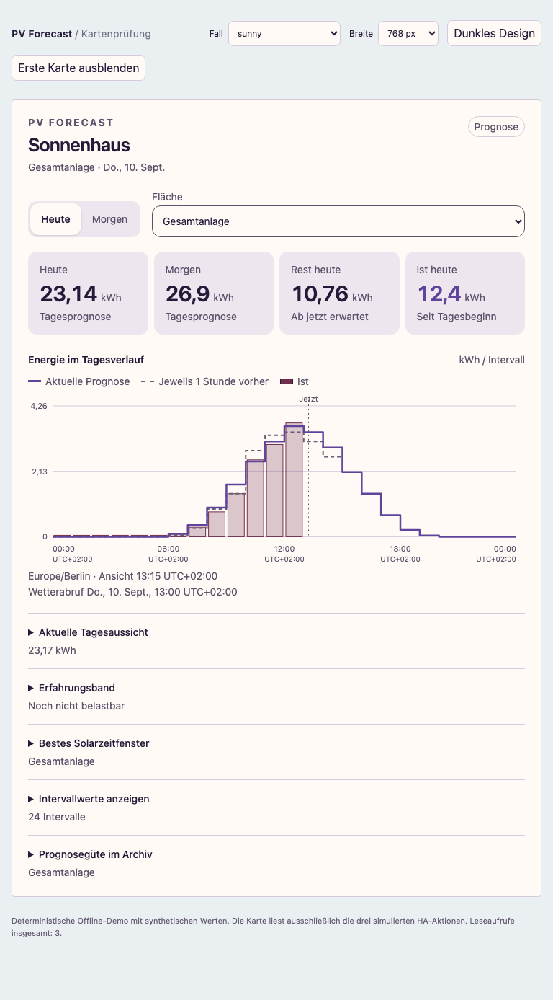

# Einheitliche Gestaltung (#111)

Die Karte verwendet gemeinsame Größen für Text, Abstände, Radien und Flächen.
Kennzahlen stehen in ruhig hinterlegten Feldern; ihr Raster richtet sich nach
Kartenbreite statt Fensterbreite. Lange Namen und große Zahlen können umbrechen.
Bedien- und Erklärungstexte sind mindestens 14 CSS-px groß. Die kompakte
Diagrammachse hat zusätzlich eine lesbare Intervalltabelle.

Karte und Panel übernehmen weiter Home-Assistant-Themefarben. Die Messkurve
mischt die Akzentfarbe mit der Textfarbe, damit ihre Kontur erkennbar bleibt.
Messwerte, Einheiten, Datenzugriff und Aktualisierungsrhythmus ändern sich nicht.

## Prüfung

Die Offline-Demo `tests/frontend/demo.html` verwendet ausschließlich synthetische
Daten. Der Browserprüfer `scripts/check_frontend_browser.cjs` prüft Layout,
Schriftgrößen und Kontraste mit Playwright. Playwright und ein Chromium-Browser
werden als vorhandene Testwerkzeuge übergeben; sie sind keine Abhängigkeit der
Integration. Die genaue Aufrufbeschreibung steht im Skript.

Die reproduzierbare Matrix umfasst 360/768/1440 px, Hell/Dunkel/ein weiteres
Theme, eine schmale Karte in einem breiten Dashboard sowie lange Namen und
große Zahlen. Geprüfte Theme-Kontraste sind keine Garantie für beliebige
benutzerdefinierte Farbpaletten. Eine echte Nutzererprobung bleibt freiwillig.

Im Review gefundene Kontrast- und Umbruchprobleme wurden behoben: sekundäre
Texte erhalten etwas mehr Textfarbenanteil, die Dachauswahl bleibt innerhalb
ihrer Grid-Spalte und lange Zahlen erhalten ein zweispaltenbreites Kennzahlenfeld.
So wird keine einzelne Nachkommastelle in eine neue Zeile verschoben.

Abgeschlossen: 14 Browserfälle jeweils mit geschlossenen und geöffneten Details,
ohne Überlauf-/Schrift-/Kontrastbefund. Zusätzlicher Grenzfall im mobilen Panel:
`123,45 kWh` lässt nur die Einheit umbrechen. 1.173 Python- und 52 Frontend-Tests
sowie Ruff, Black und Übersetzungsabgleich bestehen. Das unabhängige Review
wurde nach Behebung der Browserbefunde wiederholt.

