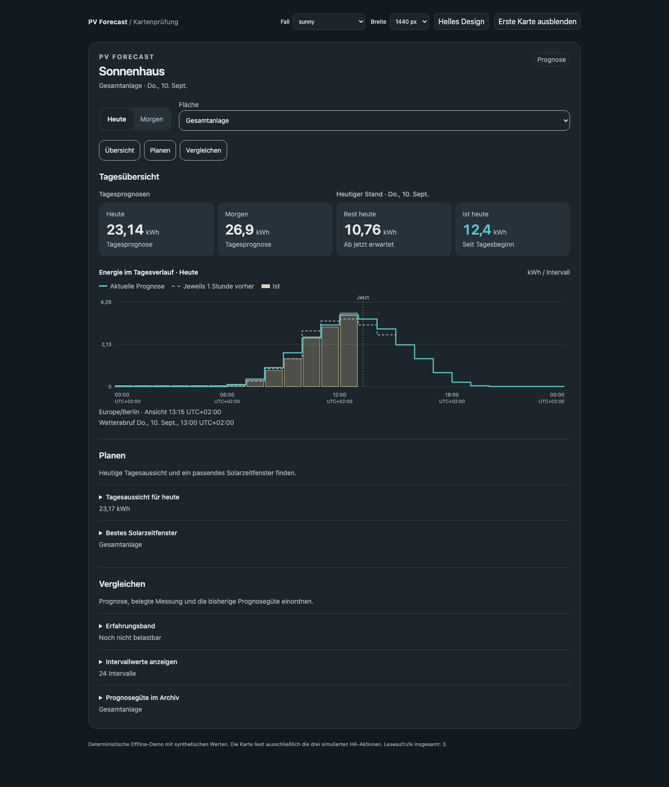

# Tagesübersicht und Aufgaben (#112)

Die Übersicht trennt Tagesprognosen von „Heutiger Stand“. Auch bei ausgewähltem
Morgen bleibt erkennbar, dass Messung und Restwert heute betreffen. Der
Diagrammtitel verwendet den Tag der tatsächlich sichtbaren Daten; während
einer noch laufenden Auswahl darf er nicht bereits den angeforderten Tag nennen.

Sprungschaltflächen führen zu fokussierbaren Überschriften. „Planen“ bündelt
die ausdrücklich heutige Tagesaussicht und das Solarzeitfenster; „Vergleichen“
bündelt Erfahrungsband, Intervalltabelle und Archiv. Bestehende Details bleiben
zunächst geschlossen und behalten ihren Öffnungszustand bei Updates. Warnungen
bleiben in der Übersicht sichtbar. Dachansichten zeigen nur verfügbare Aufgaben.

Die bestehenden Datenverträge und Leseabonnements bleiben erhalten. Updates
bewahren die Scrollposition im Dokument und im eingebetteten Panel. Alle
Messwerte, Schätzanteile und zukünftige Prognoseanteile bleiben getrennt.

Die Offline-Browserprüfung verwendet synthetische Daten. Reale Nutzererprobung
ist freiwillig; die technische Prüfung belegt weder reale Erträge noch Güte.

## Abnahme

16 Browserfälle bestanden: bestehende Breiten-/Themematrix sowie die neuen
Aufgabenabläufe im Dokument und Panel. Nach einem Rendern bleiben 450 px
Scrollposition, Fokus, fünf offene Details, 30-Tage-Auswahl und eine eingegebene
90-Minuten-Laufdauer erhalten. Sprungziele erhalten Tastaturfokus. Morgen- und
Dachauswahl wurden geprüft. Das unabhängige Review fand den Zwischenzustand des
Diagrammtitels; er ist korrigiert und durch einen eigenen Test abgesichert.

1.173 Python-Tests, 55 Frontend-Tests, Ruff, Black und Übersetzungsabgleich bestehen.

