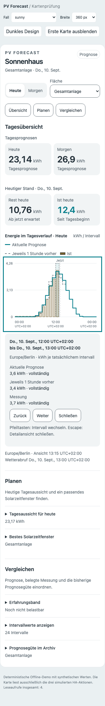
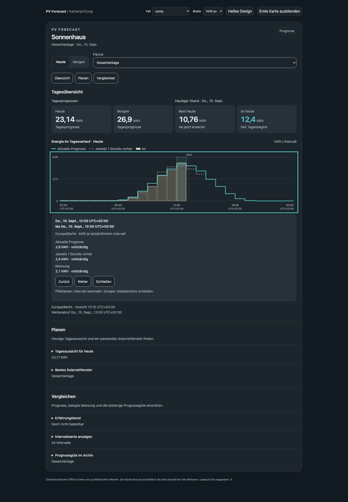

# Interaktive Intervallansicht (#113)

Tippen oder Klicken auf die Grafik wählt ein vorhandenes UTC-Intervall.
Alternativ stehen „Intervalle erkunden“, Vor/Zurück/Schließen und die
Pfeiltasten am fokussierten Diagramm zur Verfügung. Home/End wählen das erste
beziehungsweise letzte Intervall; Escape schließt nur im Diagramm-/Detailbereich.
Touch-Scrollen wird nicht unterdrückt.

Die Detailansicht zeigt Datum, Beginn und Ende mit jeweiligem UTC-Offset,
Anlagenzeitzone und die drei vorhandenen Energiereihen. Null ist ein gültiger
Wert; fehlende und vorhandene unvollständige Daten werden unterschieden.
Qualitätsmarkierungen bleiben sichtbar. Es wird keine Energie interpoliert
oder geglättet. Die vorhandene Tabelle bleibt als alternativer Zugang erhalten.

Die Auswahl speichert ausschließlich den UTC-Schlüssel; neue Werte desselben
Intervalls werden aus den aktuellen Daten gelesen. Tages-/Dachwechsel beendet
die Auswahl. Keine zusätzliche Leseaktion entsteht durch Bedienung der Grafik.

Die automatischen Auswahltests decken beide Herbststunden, Teilstunden,
Randpunkte, Nullwerte, Lücken und neue Werte eines bestehenden Schlüssels ab.
Browsernachweise verwenden ausschließlich synthetische Daten.

## Abnahme

20 Browserfälle bestehen, darunter echte Tastatur- und Touchereignisse,
vertikales Scrollen über der Grafik, beide wiederholten 02-Uhr-Stunden,
30-Minuten-Randintervalle, fehlende Reihen und der rechte Diagrammrand.
Die Auswahl bleibt beim Rendern erhalten und ändert die Zahl der Leseaufrufe
nicht. 59 Frontend- und 1.173 Python-Tests sowie Ruff, Black und der
Übersetzungsabgleich bestehen. Das unabhängige Review fand keine fachliche
Regression. Die gezielte Screenreader-Ansage bei Auswahlwechsel wird in #116
ergänzt; Tabelle und beschriftete Detailansicht sind bereits zugänglich.

