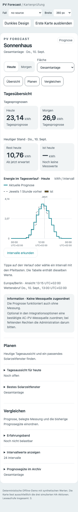
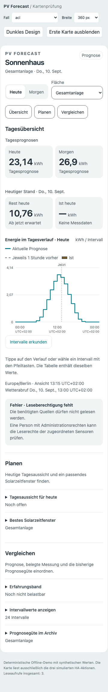

# Lade-, Leer- und Fehlerzustände (#114)

Die Karte unterscheidet Information, Einschränkung und Fehler ausdrücklich im
Text. Jeder Datenhinweis enthält eine Überschrift, Erklärung und bei Bedarf
nächste Schritte. Fehlende Quelle, noch fehlende Messung, unvollständige Messung,
veraltete Prognose, deaktiviertes/leeres Archiv, Rechte und Datenversion sind
getrennt. Gleiche Rechte-/Versionsfehler werden zusammengefasst. Einrichtungshilfe
ist bewusst textlich; es gibt keine neuen Links oder schreibenden Aktionen.

Bei vorübergehendem Lesefehler bleiben vorhandene Werte mit ihrem ursprünglichen
Wetterabruf und Ansichts-/Messzeitpunkt sichtbar. Eine neue erfolgreiche Antwort
ersetzt sie. Rechteentzug, entfernte Dachauswahl und inkompatible Versionen
bewahren keine alten betroffenen Daten. Die Fehlerwiederholung erzeugt keine
zusätzlichen Abrufe. Der erste Ladeplatzhalter reserviert Raum ohne Animation.

Eine dauerhaft verbundene Live-Region sagt nur geänderte Zustände an. Die
Hinweistexte selbst sind keine bei jedem Rendern wiederholten Live-Regionen.

## Prüfung und Review

61 Frontendtests, 1.173 Python-Tests, Ruff, Black und Übersetzungsabgleich bestehen.
Die vollständige Browsermatrix umfasst 20 Fälle in Hell/Dunkel/eigenem Theme,
Mobilansicht, Panel, DST, Teilstunden und Touch. Zusätzlich prüfen acht
Zustandsfixtures unveränderte Meldungen und einen Ablauf Erfolg → Fehler →
Wiederholung → Rechteentzug → Erholung. Synthetische Daten, keine Feldprüfung.

Reproduzieren: `node scripts/check_frontend_browser.cjs --prefix ui-114`
mit installiertem Playwright/Chromium oder den im Skript dokumentierten
Pfadangaben. Bilder und Messbefunde entstehen standardmäßig unter `/tmp/pv-ui-browser`.

Abschließendes eigenes Review: Rechte-/Versionsgrenzen, Zeitbasis des letzten
Stands, Rückweg aus entfernter Dachauswahl und unveränderte Abruffrist geprüft.
Die Fixture ohne Messquelle zeigt auch im Diagramm keine synthetische Messung.
Keine offenen blockierenden Befunde.

