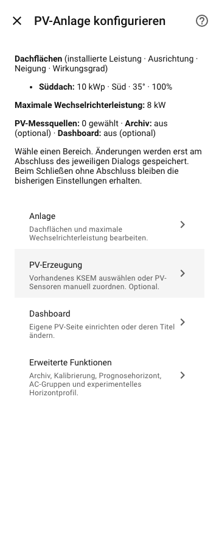
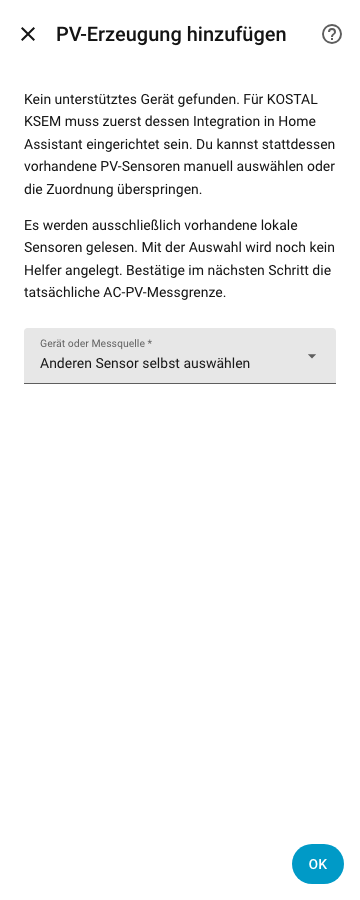
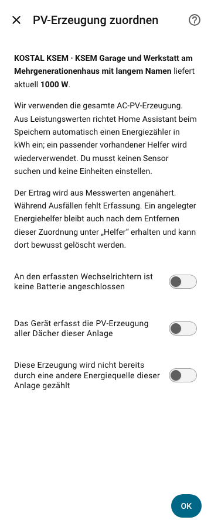

# Native Einrichtung und Optionen (#115)

Das Optionshauptmenü enthält vier Bereiche:

- **Anlage:** Dachflächen hinzufügen, bearbeiten oder entfernen; Anlagenlimit.
- **PV-Erzeugung:** Geräteassistent und manuelle Messquellenzuordnung.
- **Dashboard:** eigene PV-Seite und deren Titel.
- **Erweiterte Funktionen:** Archiv, Kalibrierung, Prognosehorizont,
  AC-Wechselrichtergruppen und experimentelles Horizontprofil.

Anlage und erweiterte Funktionen haben einen Rückweg zur Übersicht. Setup und
Optionsübersicht nennen bereits gewählte Quellen sowie Archiv-/Dashboardzustand.
Die Texte erklären, wann ein Entwurf gespeichert wird. Fachliche Speicher- und
Abbruchpfade bleiben erhalten. Fehlermeldungen zu doppelten Dachnamen,
Anlagenlimit, Prognosehorizont und Geräteauswahl erscheinen am betroffenen Feld.

Die Geräteauswahl nennt vorhandene unterstützte KSEM mit ihrem Namen. Ohne Gerät
verweist sie auf dessen zuvor einzurichtende HA-Integration, die manuelle Auswahl
und das Überspringen. Überspringen führt ohne Änderung zur Messquellenübersicht.
Die KSEM-Bestätigungen zur reinen AC-PV-Grenze, keiner Batterie und keiner
Überschneidung bleiben erforderlich und unvorbelegt. Der Integral-Helfer entsteht
weiter erst beim Speichern; sein späterer Verbleib wird vorher erklärt.

## Prüfung und Review

1.175 Python-Tests und 61 Frontendtests bestehen, ebenso Ruff, Black und
Übersetzungsabgleich. Bestehende Fachtests durchlaufen die angebotenen neuen
Menügruppen und prüfen weiterhin IDs, exakte Winkel, unabhängige Optionen,
Erstsetup, Quellenzuordnung, Helfer-Lebenszyklus und konkurrierende Dialoge.
Zusätzliche Navigationstests sichern Gruppen, Rücksprung und Überspringen ab.

Der explizite Browserlauf verwendet **echte HA-Dialoge** der lokal installierten
HA-Version 2026.8.3, einen lokalen HA-Testserver und ausschließlich synthetische
Registry-/Konfigurationsdaten. Er prüft beide Gerätefälle, manuelle Auswahl,
Menürücksprung, Abbruch sowie unvorbelegte Bestätigungen bei 360 px. Lange Namen
werden im nativen Auswahlfeld gekürzt und im Bestätigungstext vollständig
angezeigt. Keine eigene Dialoggestaltung und kein Gerätezugriff.

Reproduktion mit bereits installiertem Playwright und Chromium:

```sh
PV_PLAYWRIGHT_MODULE=/pfad/zu/playwright \
PV_CHROMIUM_EXECUTABLE=/pfad/zu/chromium \
.venv/bin/pytest -q tests/browser/native_flow.py
```

Abschließendes eigenes Review: alle bisherigen Menüaktionen sind erreichbar,
Texte stammen aus `strings.json`, Konfigurationsschema 1.1 und Speicherseiteneffekte
bleiben unverändert. Keine blockierenden Befunde. Keine reale KSEM-Erprobung.
Grundlage: [nativer HA-Config-Flow-Vertrag](https://developers.home-assistant.io/docs/core/integration/config_flow/).




