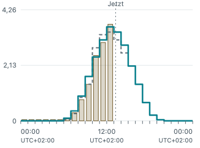

# Stundenmarkierungen im Tagesverlauf (#127)

Kurze senkrechte Striche markieren jede volle Stunde der gespeicherten Anlagenzeitzone. Sie liegen unter der Zeitachse und ergänzen die bisherigen Uhrzeitbeschriftungen. Die Position folgt derselben absoluten UTC-Achse wie die Prognose, unabhängig von Datenlücken oder Intervallgrenzen.

Wiederholte Stunden bei der Winterzeit erhalten getrennte Striche; übersprungene Stunden bleiben aus. Auch Teilstunden-Zeitzonen und halbstündige Zeitumstellungen werden berücksichtigt. Markierungen an beiden Tagesgrenzen sind enthalten. Die Darstellung verändert weder Datenwerte noch Leseaufrufe oder Diagrammbedienung.

Geprüft mit 70 Frontendtests und der Browsermatrix aus `scripts/check_frontend_browser.cjs --prefix ui-127`: 360 px, Hell/Dunkel, Kontrast, mobile Bedienung und bestehende Fokus-/Cursorprüfungen. Die folgenden Bilder verwenden synthetische Daten.

