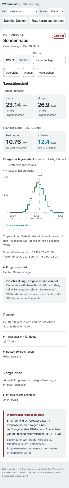
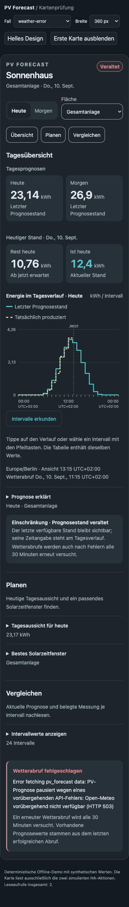

# Wetterfehler und sichtbarer Veraltungsstatus

Die synthetische Offline-Demo zeigt einen fehlgeschlagenen HTTP-503-Abruf mit
vorhandenen Prognosewerten. Im Kartenkopf steht **Veraltet** fett und rot. Die
Legende nennt den letzten Prognosestand. Am unteren Kartenende bleibt die
Protokollmeldung sichtbar; der Begleittext erklärt den erneuten Wetterabruf
alle 30 Minuten. Der eigene Abschnitt passt sich der vorhandenen Kartenfläche
und Textgröße an. Erfolgreiche Abrufe entfernen den Fehlerabschnitt.

## Browsernachweis

`scripts/check_frontend_browser.cjs --prefix ui-180` prüft 30 Browserfälle mit
vorhandenem Playwright/Chromium: 360/768/1440 px, Hell/Dunkel und eigenes Theme,
Stände mit Altersüberschreitung, Wetterfehler und Wiederherstellung, Tastatur,
Touch, Datenlücken, DST/Teilstunden, geteilte Abrufe sowie Fokus-/Scrollerhalt.
Zusätzlich prüft das Skript 320 px bei 200 Prozent Textvergrößerung. Für
Wetterfehler werden fette rote Schrift, unverdeckte Fehlermeldung am Kartenende,
30-Minuten-Hinweis, Umbruch und Textkontrast automatisch geprüft.

Alle Fälle sind bestanden. Die Bilder verwenden ausschließlich synthetische
Daten. Dieser Nachweis ersetzt keine reale Prüfung in Home Assistant oder am
betroffenen Open-Meteo-Endpunkt.

| 360 px, hell | 360 px, dunkel |
| --- | --- |
|  |  |
